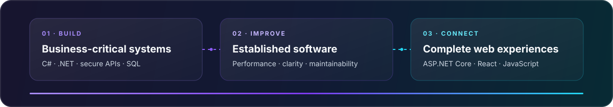
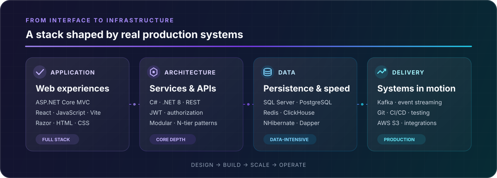
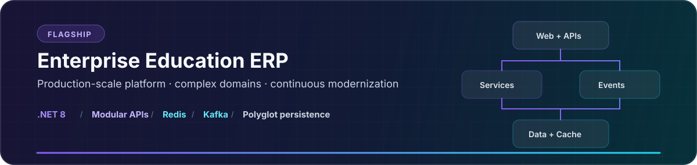
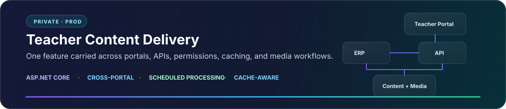
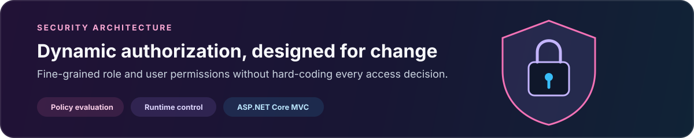

  

## About me

I'm a software engineer focused on building and evolving business-critical applications with **C# and .NET**. My work spans backend architecture, secure APIs, data-heavy workflows, caching, and the web interfaces that bring those systems to life.

I enjoy the engineering that begins after the first demo: untangling complex domains, improving performance and reliability, modernizing established systems, and making large codebases easier to change.

  

## Engineering toolkit

  

  Depth in the Microsoft ecosystem, with practical experience across data systems, caching, and modern frontend development.

## Selected engineering work

> A closer look at the systems, architecture, and product thinking behind my work.

  
<strong>Inside the system — architecture and scope</strong>

   

- A production platform serving interconnected **student, teacher, exam, finance, scheduling, and content** workflows.
- Modular **.NET 8** web applications, REST APIs, background services, and Windows desktop utilities.
- Polyglot persistence across **SQL Server, PostgreSQL, ClickHouse, SingleStore, MongoDB, and Redis**.
- External service integrations supporting media, communication, and payment workflows.
- Ongoing modernization of a mature codebase using layered architecture, repositories, caching, and incremental migration.

Commercial code is private; the architecture summary reflects the system I actively contribute to.

 

  
<strong>Inside the feature — end-to-end ownership</strong>

   

- Delivered a cross-application content workflow spanning the core ERP, **Teacher Portal**, and supporting APIs.
- Implemented permission-aware access, service and data layers, caching helpers, and scheduled processing.
- Supported lecture files and media through content updates and synchronization flows.
- Integrated the feature into an established production architecture while preserving existing behavior.

Commercial code is private; this summary is based on the components and responsibilities visible in my contribution history.

 

  <a href="https://github.com/Tusher-Ahmed/Dynamic-Role-Based-Authorization-Asp.Net-Core"><strong>Role-based implementation →</strong></a>
  &nbsp;·&nbsp;
  <a href="https://github.com/Tusher-Ahmed/Dynamic-User-Based-Authorization-ASP.Net-Core"><strong>User-based implementation →</strong></a>

 

  <em>Let's build software that stays understandable as it grows.</em>
    
  

