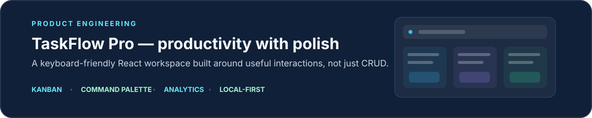
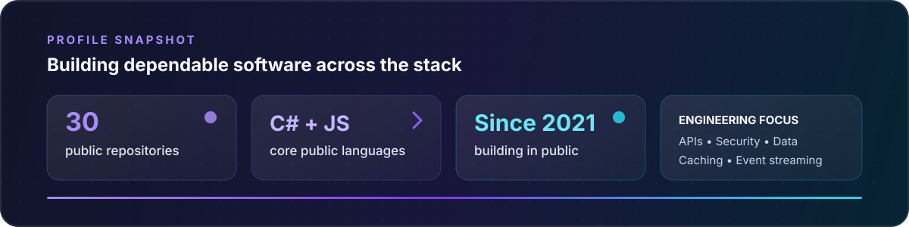

<div align="center">
  
</div>

<div align="center">

[](https://www.linkedin.com/in/tusher-ahmed-6b9b70210)
[](https://github.com/Tusher-Ahmed)
[](https://github.com/Tusher-Ahmed)

</div>

## Hello — I'm Tusher 👋

I'm a software engineer focused on building and evolving business-critical applications with **C# and .NET**. My day-to-day work spans backend architecture, secure APIs, data-heavy workflows, caching, event-driven integrations, and the web interfaces that bring those systems to life.

I enjoy the engineering work that happens after the first demo: untangling complex domains, improving reliability, modernizing legacy systems, and making large codebases easier to change.

```text
Current focus  →  Enterprise .NET · distributed systems · performance · maintainability
Strongest in   →  C# · ASP.NET Core · REST APIs · SQL · Redis · Kafka
Also building  →  React · JavaScript · responsive, accessible web interfaces
```

## Engineering toolkit

<div align="center">
  
</div>

<p align="center">
  <sub>Depth in the Microsoft ecosystem, with practical experience across distributed data, event streaming, and modern frontend delivery.</sub>
</p>

## Selected engineering work

> A closer look at the systems, architecture, and product thinking behind my work.

<a href="#enterprise-education-erp">
  
</a>

<details id="enterprise-education-erp">
  <summary><strong>Inside the system — architecture and scope</strong></summary>
  <br/>

- A production platform serving interconnected **student, teacher, exam, finance, scheduling, and content** workflows.
- Modular **.NET 8** web applications, REST APIs, background services, and Windows desktop utilities.
- Polyglot persistence across **SQL Server, PostgreSQL, ClickHouse, SingleStore, MongoDB, and Redis**.
- Event-driven integrations through **Kafka**, with AWS S3, video processing, Zoom, and payment services.
- Ongoing modernization of a mature codebase using layered architecture, repositories, caching, testing, and CI/CD.

<sub>Commercial code is private; the architecture summary reflects the system I actively contribute to.</sub>
</details>

<br/>

<a href="https://github.com/Tusher-Ahmed/Dynamic-Role-Based-Authorization-Asp.Net-Core">
  
</a>

<p align="right">
  <a href="https://github.com/Tusher-Ahmed/Dynamic-Role-Based-Authorization-Asp.Net-Core"><strong>Role-based implementation →</strong></a>
  &nbsp;·&nbsp;
  <a href="https://github.com/Tusher-Ahmed/Dynamic-User-Based-Authorization-ASP.Net-Core"><strong>User-based implementation →</strong></a>
</p>

<a href="https://tusher-ahmed.github.io/Local-Todo/">
  
</a>

<p align="right">
  <a href="https://github.com/Tusher-Ahmed/Local-Todo"><strong>Explore the code →</strong></a>
  &nbsp;·&nbsp;
  <a href="https://tusher-ahmed.github.io/Local-Todo/"><strong>Open the live product →</strong></a>
</p>

## Engineering profile

<div align="center">
  <a href="https://github.com/Tusher-Ahmed?tab=repositories">
    
  </a>
</div>

<br/>

<div align="center">
  <em>Let's build software that stays understandable as it grows.</em>
  <br/><br/>
  
</div>
